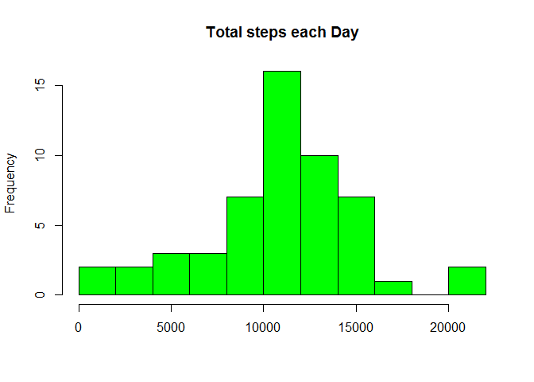
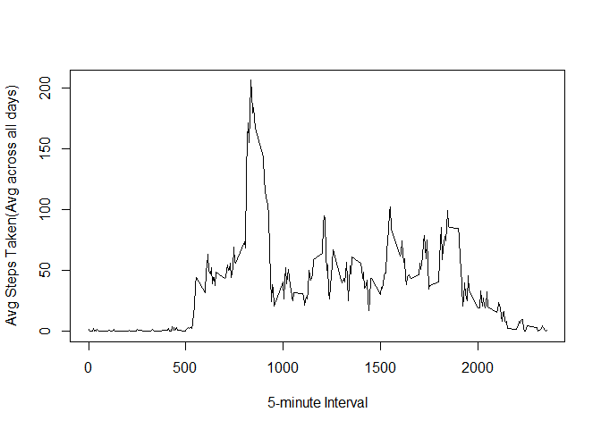
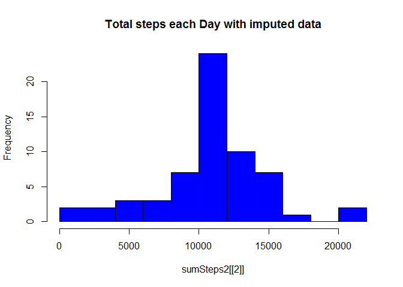
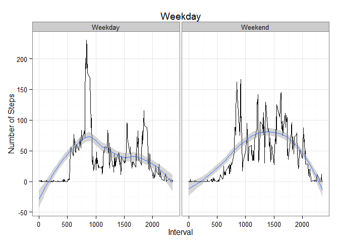

# Reproducible Research: Peer Assessment 1

## Loading required libraries

```r
library(dplyr)
```

```
## 
## Attaching package: 'dplyr'
## 
## The following objects are masked from 'package:stats':
## 
##     filter, lag
## 
## The following objects are masked from 'package:base':
## 
##     intersect, setdiff, setequal, union
```

```r
library(ggplot2)
packageVersion("dplyr")
```

```
## [1] '0.2'
```

## Loading and preprocessing the data


```r
mydf <- read.csv("activity.csv",stringsAsFactors = FALSE)
mydf2 <- tbl_df(mydf)
mydf4 <- tbl_df(mydf)
mydf3 <- filter(mydf2,!is.na(steps))
```

## What is mean total number of steps taken per day?

 1. Make a histogram of the total number of steps taken each day
 2. Calculate and report the mean and median total number of steps taken per day


```r
by_date <- group_by(mydf3,date)
sumSteps <- summarize(by_date, sum(steps))
names(sumSteps) [2] <- c("TotalSteps")
hist(sumSteps[[2]],breaks=10,col="Green",main="Total steps each Day", xlab="")
```

 

```r
print(mean(sumSteps$TotalSteps))
```

```
## [1] 10766
```

```r
print(median(sumSteps$TotalSteps))
```

```
## [1] 10765
```


## What is the average daily activity pattern?

 1. Make a time series plot (i.e. type = "l") of the 5-minute interval (x-axis) and the average number of steps taken, averaged across all days (y-axis)


```r
by_interval <- group_by(mydf3,interval)
meanSteps <- summarize(by_interval, mean(steps))
names(meanSteps) [2] <- c("AvgSteps")
plot(meanSteps$interval,meanSteps$AvgSteps,type='l', xlab="5-minute Interval", ylab="Avg Steps Taken(Avg across all days)")
```

 

```r
# Which 5-minute interval, on average across all the days in the dataset, contains the maximum number of steps?

print(mydf3[mydf3[,1]==max(mydf3[1]),][,c(1,3)])
```

```
## Source: local data frame [1 x 2]
## 
##       steps interval
## 14476   806      615
```


```r
# Calculate and report the total number of missing values in the dataset 

print(nrow(mydf2)-nrow(mydf3))
```

```
## [1] 2304
```

## Imputing missing values


```r
# Devise a strategy for filling in all of the missing values in the dataset. 

for (i in 1:nrow(meanSteps)){
  for (j in 1:nrow(mydf4)) {
    if (mydf4[j,3]==meanSteps[i,1] && (is.na(mydf4[j,1]))) {
      mydf4[j,1] <- meanSteps[i,2]
    }
  }
}

# Make a histogram of the total number of steps taken each day and Calculate and report the mean and median total number of steps taken per day. 

by_date2 <- group_by(mydf4,date)
sumSteps2 <- summarize(by_date2, sum(steps))
names(sumSteps2) [2] <- c("TotalSteps")
hist(sumSteps2[[2]],breaks=10,col="blue",main="Total steps each Day with imputed data")
```

 

```r
print(mean(sumSteps2$TotalSteps))
```

```
## [1] 10766
```

```r
print(median(sumSteps2$TotalSteps))
```

```
## [1] 10766
```

```r
# Do these values differ from the estimates from the first part of the assignment? What is the impact of imputing missing data on the estimates of the total daily number of steps?

# The mean steps were used as missing value, the median has shifted slightly, the mean remains the same. The data has moved closer to mean.
```


## Are there differences in activity patterns between weekdays and weekends?


```r
write.csv(mydf4, file = "mydf5.csv")
mydf5 <- read.csv("mydf5.csv",stringsAsFactors = FALSE)
mydf5[,5] <- as.Date(paste(mydf5[,3]), "%Y-%m-%d") 
mydf5[,6] <- weekdays(mydf5[,5])
mydf5[,7] <- mydf5[,6]
mydf5[(mydf5[,7] != "Saturday") & (mydf5[,7] != "Sunday"),7] <- "Weekday"
mydf5[(mydf5[,7] == "Saturday") | (mydf5[,7] == "Sunday"),7] <- "Weekend"
mydf5 <- select(mydf5, -X) 
names(mydf5)[4] <- "DateForm"
names(mydf5)[5] <- "Day"
names(mydf5)[6] <- "DayType"
mydf5[,3] <- as.character(mydf5[,3])
write.csv(mydf5, file = "mydf6.csv")
mydf6 <- read.csv("mydf6.csv",stringsAsFactors = FALSE)
mydf7 <- tbl_df(mydf6)
mydf8 <- filter(mydf7, DayType == "Weekday")
mydf9 <- filter(mydf7, DayType == "Weekend")
by_interval2 <- group_by(mydf8,interval)
meanSteps2 <- summarize(by_interval2, mean(steps))
names(meanSteps2) [2] <- c("AvgSteps")
meanSteps3 <- mutate(meanSteps2,DayType="Weekday")
by_interval3 <- group_by(mydf9,interval)
meanSteps4 <- summarize(by_interval3, mean(steps))
names(meanSteps4) [2] <- c("AvgSteps")
meanSteps5 <- mutate(meanSteps4,DayType="Weekend")
meanSteps6 <- rbind(meanSteps3,meanSteps5)

# Plot 
a <- ggplot(data = meanSteps6, aes(x = interval, y = AvgSteps))
a <- a + theme_bw()
a <- a + geom_line()+facet_grid(~DayType)
a <- a + geom_smooth()
a <- a + xlab("Interval") + ylab("Number of Steps") + ggtitle("Weekday")
a
```

```
## geom_smooth: method="auto" and size of largest group is <1000, so using loess. Use 'method = x' to change the smoothing method.
## geom_smooth: method="auto" and size of largest group is <1000, so using loess. Use 'method = x' to change the smoothing method.
```

 
